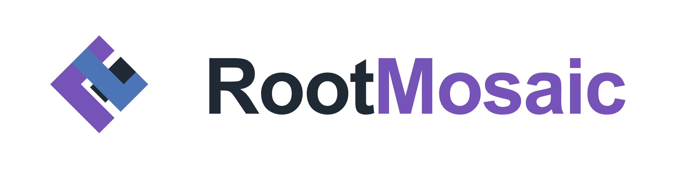
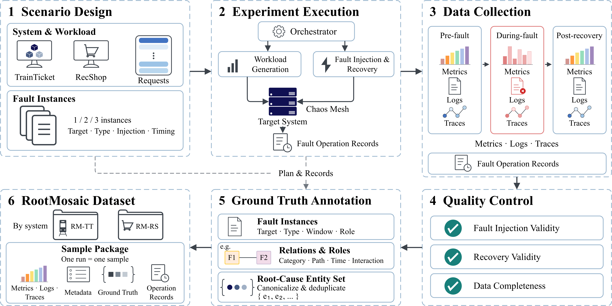

<p align="center">
  
</p>

---

# RootMosaic

*A Relation-Aware Benchmark for Diagnosing Multiple Root Causes in Microservice Systems*

<p>
  <a href="#datasets"></a>
  <a href="#datasets"></a>
  <a href="#datasets"></a>
  <a href="#what-a-sample-contains"></a>
</p>

[Overview](#overview) | [Datasets](#datasets) | [Hugging Face Dataset](https://huggingface.co/datasets/RootMosaic/Anonymous) | [Collection Code](#collection-code) | [Evaluation](#evaluation)

<a id="overview"></a>

RootMosaic is a multimodal benchmark for root cause analysis (RCA) under single
and multiple faults in microservice systems. It combines experiments on
**TrainTicket**, a train-ticket booking system, and **RecShop**, an e-commerce
recommendation system.

The benchmark supports evaluating whether a method can identify part of a
root-cause set, recover the complete set, and maintain localization performance
when faults are composed. Samples provide metrics, logs, traces, and ground
truth, together with fault-instance records and available relationship
annotations for more detailed analysis.

This repository hosts the two systems' **deployment and data-collection code**.
Dataset archives are distributed separately through Hugging Face.

<a href="RecShop/assets/figures/rootmosaic-construction-pipeline.png"></a>

## Datasets

| Dataset | System | Fault scenarios | Repetitions per scenario | 1-fault samples | 2-fault samples | 3-fault samples | Total fault samples |
| --- | --- | ---: | ---: | ---: | ---: | ---: | ---: |
| **RM-TT** | TrainTicket | 50 | 5 | 90 | 120 | 40 | **250** |
| **RM-RS** | RecShop | 69 | 5 | 150 | 170 | 25 | **345** |
| **Total** | 2 systems | **119** | 5 | **240** | **290** | **65** | **595** |

Counts above describe the current fault-data releases. The TrainTicket
collection plan additionally contains five no-fault scenarios with five
repetitions each; those 25 baseline runs are excluded from this table.

**Fault instances and root-cause entities are distinct.** Multiple injected
faults may target the same entity. The table groups samples by fault-instance
count; entity-level evaluation uses the set of distinct canonical root-cause
entities in each sample's labels.

### What a sample contains

| Content | Description |
| --- | --- |
| Metrics | Timestamped telemetry with entity and observation-stage information. |
| Logs | Component logs associated with the sample's collection windows. |
| Traces | Distributed tracing records; available views are documented by each dataset. |
| Ground truth | Root-cause entities and fault-instance descriptions, including target, fault type, and injection mechanism. |
| Collection records | Injection/recovery records, stage windows, sample identity, and validation or delivery status. |
| Relationship annotations | Available fault-category, temporal, request-path, and interaction annotations, as recorded in the release. |

Observations are organized around **pre-fault**, **during-fault**, and
**post-recovery** stages. Use the recorded timestamps and modality manifests
to determine actual coverage. Annotation and modality availability can vary
across samples; consult the individual dataset documentation.

## Data Download

The data archives and collection code are maintained separately. Both datasets
share the [RootMosaic dataset repository on Hugging Face](https://huggingface.co/datasets/RootMosaic/Anonymous/tree/main).
Choose the archive for the system you want to use.

| Dataset | Data release | Download |
| --- | --- | --- |
| RM-TT | 250 TrainTicket fault samples | [Hugging Face](https://huggingface.co/datasets/RootMosaic/Anonymous/tree/main) |
| RM-RS | 345 RecShop fault samples | [Hugging Face](https://huggingface.co/datasets/RootMosaic/Anonymous/tree/main) |

After downloading, use the entry points provided by each archive:

| Dataset | Sample index | Sample directories | Additional entry points |
| --- | --- | --- | --- |
| RM-TT | `index.jsonl` | `samples/` | `manifest.json`, `labels/`, `topology/`, `checksums.sha256` |
| RM-RS | `MANIFEST.json` / `MANIFEST.csv` | `traditional/single/`, `traditional/dual/`, `traditional/triple/` | `RELEASE.json`, `design/`, `adapter/`, `SHA256SUMS` |

Follow the archive's own README for reading and integrity checks. The two
archives have different native layouts; resolve samples through their indices
instead of assuming identical directory structures.

## Collection Code

```text
RootMosaic/
├── README.md
├── RecShop/                         # RecShop platform and collection workflow
└── rootmosaic-trainticket-collector/ # TrainTicket collection workflow
```

| System | Code and quick start | Deployment and environment | Collection workflow |
| --- | --- | --- | --- |
| **TrainTicket** | [English](rootmosaic-trainticket-collector/README.md) · [中文](rootmosaic-trainticket-collector/README.zh-CN.md) | [Environment setup](rootmosaic-trainticket-collector/docs/SETUP.md) | [Collection protocol](rootmosaic-trainticket-collector/docs/COLLECTION.md) |
| **RecShop** | [English](RecShop/README.md) · [中文](RecShop/README_CN.md) | [Deployment](RecShop/docs/DEPLOYMENT.md) · [Collection environment](RecShop/docs/COLLECTION-ENVIRONMENT.md) | [Collection workflow](RecShop/docs/COLLECTION.md) · [Data format](RecShop/docs/DATA-FORMAT.md) |

Clone the repository:

```bash
git clone https://github.com/springflowerbaby/RootMosaic.git
cd RootMosaic
```

To **use the released data**, download the archives; a live deployment is not
required. To **collect new data**, follow the relevant system guide to prepare
the application, monitoring infrastructure, fault-injection tools, and local
configuration.

Both collection workflows currently use a **Windows control host** with
Kubernetes-hosted workloads. Dependency versions, image requirements, secrets,
and startup procedures are system-specific. Run collection against a dedicated
experiment environment and inspect the generated validation reports.

## Evaluation

RootMosaic supports ranking-based localization and paired analysis of
localization changes under fault composition.

| Metric | Interpretation |
| --- | --- |
| **Hit@K** | Whether the Top-K candidates contain at least one true root-cause entity. |
| **Recall@R** | Fraction of true root-cause entities recovered within the Top-R candidates. |
| **FullHit@R** | Whether the Top-R candidate set exactly matches the complete ground-truth entity set. |
| **NDCG@R** | Ranking quality with binary relevance, normalized by the ideal ranking. |
| **MaskingRate@3** | Among valid pairs where a target is in the single-fault Top-3, the fraction where it falls outside the multi-fault Top-3. |
| **EnhancementRate@3** | Among valid pairs where a target is outside the single-fault Top-3, the fraction where it enters the multi-fault Top-3. |

Here, **R is the number of distinct ground-truth root-cause entities** and is
used only as an evaluation cutoff. Normalize candidate identifiers and remove
duplicates while preserving ranking order before scoring. The first four
metrics are computed per sample; report the averaging and data-split protocol
alongside aggregate results.

For paired analysis, match samples by target entity, fault type, injection
mechanism, and replicate identifier, and document validity exclusions. Matching
these fields alone does not establish equal workload or fault intensity.
The two conditional rates use different denominators, are undefined when their
respective denominators are zero, and cannot be subtracted to obtain a net
change. They describe localization outcomes rather than establish fault
interaction mechanisms.

### Using the benchmark

- Keep ground truth, injection commands, and operation records separate from
  diagnostic input features. Use observation windows appropriate to the task.
- When defining training/test splits, group repeated samples of the same fault
  scenario together to avoid overlap across splits.
- Match a method's candidate scope to the dataset's ground truth, including
  database or infrastructure entities where applicable.
- Preserve missing observations and unavailable annotations explicitly instead
  of treating them as measured zeros or assigning inferred relationship labels.

The evaluation definitions above describe the benchmark protocol. Executable
entry points and supported artifacts are documented within each component;
this repository overview does not assume a shared top-level evaluation CLI.

## License and Attribution

Licensing is component-specific. See [RecShop's license](RecShop/LICENSE.md)
and the TrainTicket collector's
[third-party notices](rootmosaic-trainticket-collector/THIRD_PARTY_NOTICES.md).
Dataset licenses are specified separately by their releases; code licenses
do not automatically apply to the datasets or external model assets.

## Questions

Please use [GitHub Issues](https://github.com/springflowerbaby/RootMosaic/issues)
for questions about the benchmark or collection code. Include the dataset
version, system, and relevant sample or scenario identifiers when reporting an
issue.
