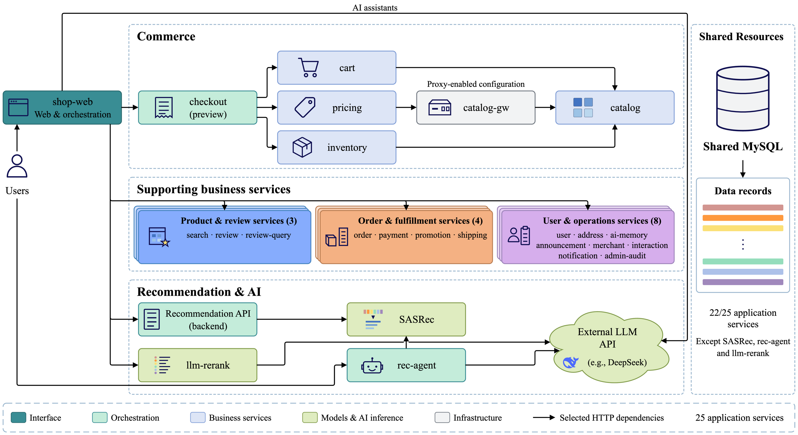
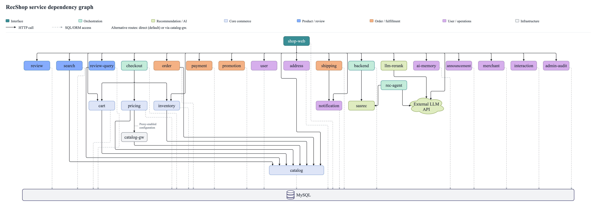

<p align="center">
  
</p>

---

# RecShop

*面向微服务故障诊断研究的电商推荐平台。*

<p>
  <a href="LICENSE.md"></a>
  <a href="ENVIRONMENT.md"></a>
  <a href="docs/DEPLOYMENT.md"></a>
  <a href="docs/COLLECTION-ENVIRONMENT.md"></a>
</p>

[快速开始](#快速开始) | [采集指南](docs/COLLECTION.md) | [数据集指南](docs/DATA-MIGRATION.md) | [English](README.md)

平台包含 25 个应用服务：24 个 Flask 服务和 1 个 FastAPI SASRec 推理服务。多数业务服务共享 MySQL；推荐工作流、模型服务和 LLM 重排是真实业务功能，不是故障采集控制器。内部模块、镜像和服务标识保留兼容名称。

<a href="assets/figures/recshop-system-overview.png"></a>

<a href="assets/figures/recshop-service-dependencies.png"></a>

下表汇总 25 个应用服务。服务职责、端口与业务边界见[完整服务说明](services/README.md)。

| 功能组 | 数量 | 服务 |
|---|---:|---|
| Web 界面 | 1 | [shop_web](services/shop_web/) |
| 核心电商 | 5 | [checkout_service](services/checkout_service/)、[cart_service](services/cart_service/)、[pricing_service](services/pricing_service/)、[inventory_service](services/inventory_service/)、[catalog_service](services/catalog_service/) |
| 商品与评论 | 3 | [search_service](services/search_service/)、[review_service](services/review_service/)、[review_query_service](services/review_query_service/) |
| 订单与履约 | 4 | [order_service](services/order_service/)、[payment_service](services/payment_service/)、[promotion_service](services/promotion_service/)、[shipping_service](services/shipping_service/) |
| 用户与运营 | 8 | [user_service](services/user_service/)、[address_service](services/address_service/)、[ai_memory_service](services/ai_memory_service/)、[announcement_service](services/announcement_service/)、[merchant_service](services/merchant_service/)、[interaction_service](services/interaction_service/)、[notification_service](services/notification_service/)、[admin_audit_service](services/admin_audit_service/) |
| 推荐与 AI | 4 | [backend_api](services/backend_api/)、[sasrec_api](services/sasrec_api/)、[llm_rerank_service](services/llm_rerank_service/)、[recommendation_agent](services/recommendation_agent/) |

## 界面截图

| 首页 | 商品详情 |
|---|---|
| [](assets/screenshots/recshop-home.jpg) | [](assets/screenshots/recshop-product.jpg) |

## 快速开始

根目录提供三个主入口，其它启动、检查和采集入口位于 `scripts/entrypoints/`。

| 任务 | 入口 | 用途 |
|---|---|---|
| 安装依赖 | [install_dependencies.ps1](install_dependencies.ps1) | 安装 Python 依赖；其它基础设施与资产需单独准备 |
| 部署业务系统 | [deploy_recshop.ps1](deploy_recshop.ps1) | 部署独立业务实例 |
| 检查或恢复采集环境 | [start_collection_environment.ps1](start_collection_environment.ps1) | 检查或恢复已准备的采集环境；不代替首次部署，也不自动采集 |

### 1. 安装依赖与准备资产

使用 Python 3.10，根目录只维护一份 `requirements.txt`，覆盖业务、部署和采集/迁移所需 Python 依赖。Docker、Kubernetes、业务镜像、数据库和模型仍需另外准备。

```powershell
.\install_dependencies.ps1 -Python python
```

此清单已在 Windows 的全新 Python 3.10 Conda 环境中完成安装、依赖一致性检查、关键模块导入和离线工具验证；实际模型加载与业务服务启动仍需另行验证。具体版本见[运行环境](ENVIRONMENT.md)。

也可直接用 `python -m pip install -r requirements.txt` 安装同一完整清单；安装器的 `-CheckOnly -PythonOnly` 只检查三个采集宿主必要包及 Python 3.10，不代表全部业务依赖或业务环境已就绪。本地 PyTorch 仍按 CPU/CUDA 选择安装来源。普通服务基础镜像和 SASRec 镜像均先装 CPU 版 2.5.1 再读同一清单，统一清单因此会增加普通服务镜像体积。

复制 `.env.example` 为本地 `.env`，提供自己的数据库、会话密钥及可选 LLM 配置。模型权重、RecBole 缓存和商品文件不随代码提供，来源、配套关系及已知文件校验值见[资产与环境](ENVIRONMENT.md)。业务 API 面向可信内网；不要将管理和数据接口无隔离地公开暴露。

#### 下载复现资产

[从 Google Drive 下载复现资产包](https://drive.google.com/drive/folders/1oXmQEjIg4rRb9ivikw2tkI93fmr9AnCc?usp=sharing)。下载 `RecShop-reproduction-20261003.zip`（约 2.32 GiB），内含以下外部文件：

| 包内文件 | 内容与用途 |
|---|---|
| `model-assets/SASRec-Feb-24-2026_17-54-22.pth` | 已训练的 SASRec 模型权重。 |
| `model-assets/standard_cache.pkl` | 配套 RecBole 配置、处理后的数据集、商品／用户 ID 映射与序列；当前推理服务需要它。 |
| `model-assets/electronics.item` | 商品 ID、标题和商品属性。 |
| `data-import/electronics.inter` | 按需导入数据库的交互记录；加载已提供的模型和缓存不需要读取它。 |

压缩包还包含中英文放置说明、部署资产配置片段、资产清单及 SHA256 校验值。Kubernetes 部署时，将 `model-assets/` 放到本仓库的 `local-assets/model-assets/`，并把包内资产配置合入本地部署配置，具体见[部署说明](docs/DEPLOYMENT.md)；本地 Python 服务的放置方式见包内 README。

数据库准备方式见[运行环境说明](ENVIRONMENT.md)中的建表与数据导入指引；故障观测数据的转换和使用见[数据集工作流](#数据集工作流)。

### 2. 部署业务系统

有可用 Kubernetes、镜像和模型资产时，从[独立部署说明](docs/DEPLOYMENT.md)创建一个新实例：

```powershell
Copy-Item deployment.example.json deployment.local.json
# 先填写独立context、namespace、镜像和资产配置。
.\deploy_recshop.ps1 -Python python -Config deployment.local.json -Render -Out deployment-plan.json
# 按部署说明提供秘密环境变量后，显式部署并检查。
.\deploy_recshop.ps1 -Python python -Config deployment.local.json
python scripts/entrypoints/check_recshop.py --config deployment.local.json
```

以后用 `python scripts/entrypoints/start_recshop.py --config deployment.local.json` 恢复同一已登记实例。业务环境就绪（机器输出 `BUSINESS_READY`）只表示业务检查通过，不等于故障采集环境就绪。首次部署创建独立 MySQL/PVC 和最小合成商品，不接管已有研究库，也不会下载模型或调用付费 LLM。

本地开发可在准备好 MySQL、模型和配置后运行 `python scripts/entrypoints/start_local_services.py`；它与 Kubernetes 入口是两条不同路径。服务、端口和业务边界见 [services/README.md](services/README.md)。

## 数据采集

实际采集与故障恢复使用 Windows 控制宿主；这与业务容器和 Kubernetes 工作节点运行 Linux 并不矛盾。先按[采集环境准备](docs/COLLECTION-ENVIRONMENT.md)配置网关、Chaos Mesh、指标/链路/日志设施、CRI 资源导出器、数据库和环境身份，再准备新计划。环境恢复脚本不代替首次部署，也不自动采集。

首次使用先从环境示例创建私有 `*.local.json` 并填写本机真实身份，秘密单独保存。已有环境沿用其登记的 lease 和 worker 记录；移动代码目录后，可显式填写既有 Docker 的 `windows_startup.bind_sources`，不重挂旧数据。恢复和只读检查使用 `start_collection_environment.ps1 -Environment <私有配置>`，具体首次准备与已有环境步骤见上述说明。

```powershell
.\start_collection_environment.ps1 -Environment configs/collection/environment.local.json -CheckOnly
# 已完成首次准备且配置允许恢复时：
.\start_collection_environment.ps1 -Environment configs/collection/environment.local.json
```

正式采集由 `scripts/entrypoints/collect_dataset.ps1` 显式触发；采集流程、69 场景的版本化配置、串行执行和批末决议见[采集入口](docs/COLLECTION.md)。计划必须绑定新副本的实际源码、场景条件及新环境；不沿用其他机器的 UID、数据库校验值或其他环境的就绪记录。数据分别保留每次运行和选用槽位，重试不会自动增加重复数。

## 数据集工作流

已接受的正式样本按[迁移工具说明](scripts/dataset/README.md)冻结输入、导出已有历史观测、转换并读回。输出使用独立的 `runs/`、`outputs/` 目录，不覆盖原始数据或已有交付。

迁移会自动补充版本化的路径关系、交互意图、故障角色和计划时间设计标签，沿用 strict255 已有标签取值；每次运行的实际窗口另行保留。字段含义见[设计标签说明](docs/DATA-FORMAT.md#design-labels)。

V1 数据包包含样本身份、GT 映射、观测文件和来源记录。字段含义、模态可用性及分析适用范围见[数据格式说明](docs/DATA-FORMAT.md)。实验数据包作为独立输入，不随源码打包。

## 文档导航

| 内容 | 文档 |
|---|---|
| Python 依赖、模型与数据资产 | [运行环境与资产](ENVIRONMENT.md) |
| 独立业务实例的部署与检查 | [部署说明](docs/DEPLOYMENT.md) |
| 应用服务、端口与职责 | [服务说明](services/README.md) |
| 采集基础设施与环境身份 | [采集环境准备](docs/COLLECTION-ENVIRONMENT.md) |
| 版本化场景、计划与采集入口 | [采集流程](docs/COLLECTION.md) |
| 数据导出、转换与读回 | [迁移工具](scripts/dataset/README.md) |
| 脚本用途、入口与使用状态 | [脚本索引](scripts/README.md) |
| 样本身份、GT 与观测格式 | [数据格式](docs/DATA-FORMAT.md) |

## 边界与来源

- checkout 是只读串行预览；支付为模拟记录流程，不是生产级分布式事务系统。
- pricing 默认直连 catalog；采用网关的实验在测量前接入 catalog-gw，三个观察阶段保持路由，结束后恢复。
- 外部 LLM 仅由相应业务功能调用，普通业务和 SASRec 推理不必依赖外部模型。
- 部署前提、验证范围及目标环境检查步骤见[部署说明](docs/DEPLOYMENT.md#验证范围)和[采集环境准备](docs/COLLECTION-ENVIRONMENT.md)。
- 代码许可见 [LICENSE.md](LICENSE.md)。模型、数据与代码的再分发范围分别核对。
